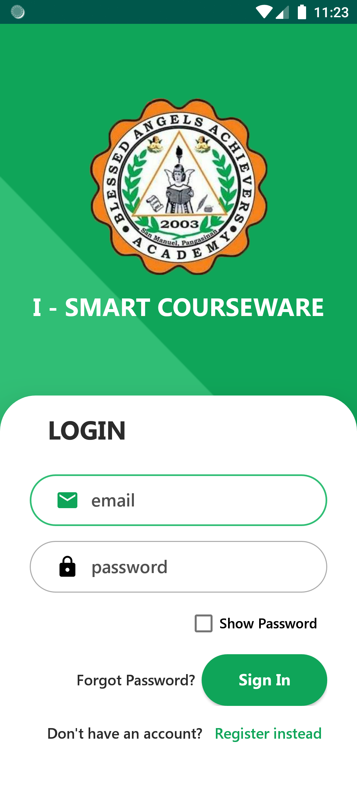
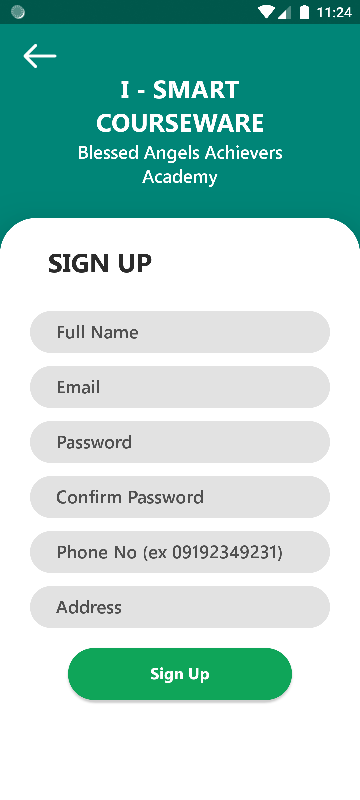
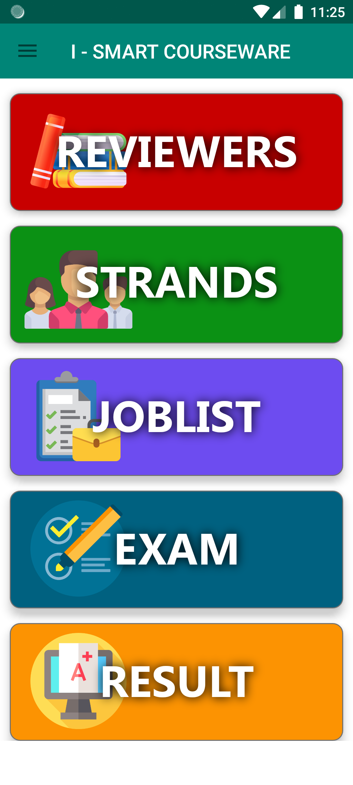
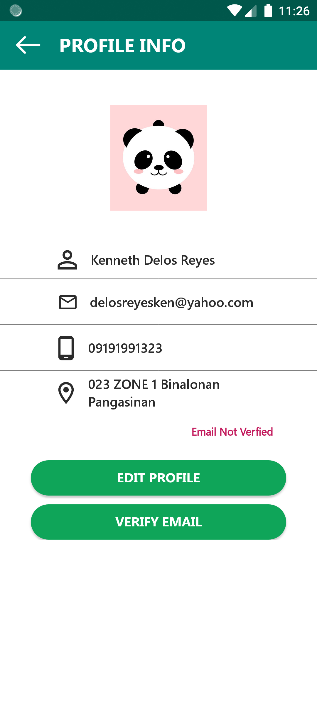
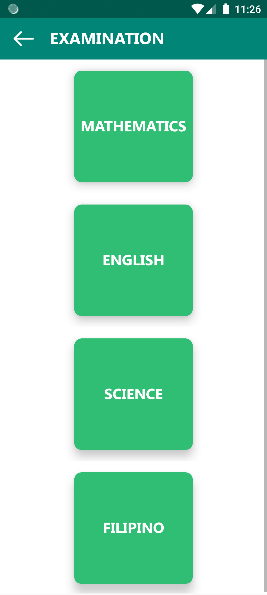
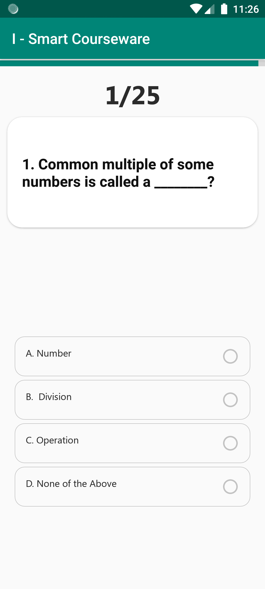

# I-Smart-Courseware

I – Smart Courseware This app is about junior high school students to take a test and determine what strand for senior high school best suits them using the results of their test.

## Screenshots

